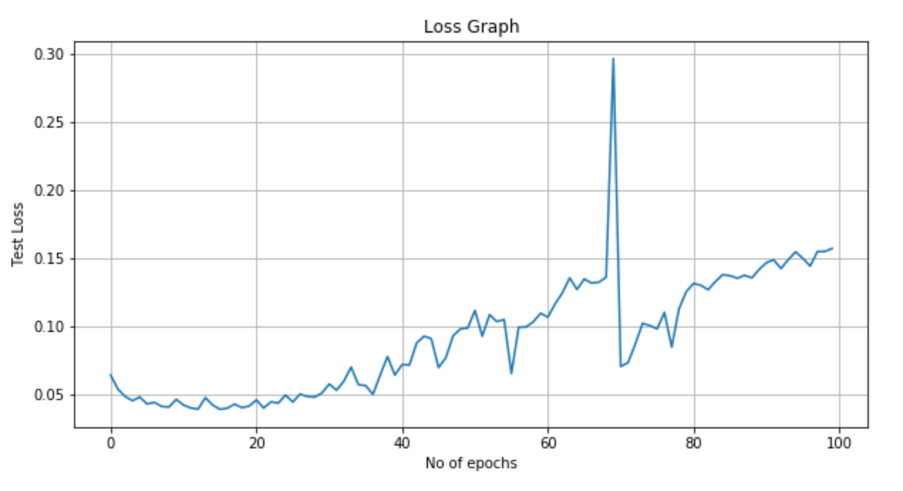
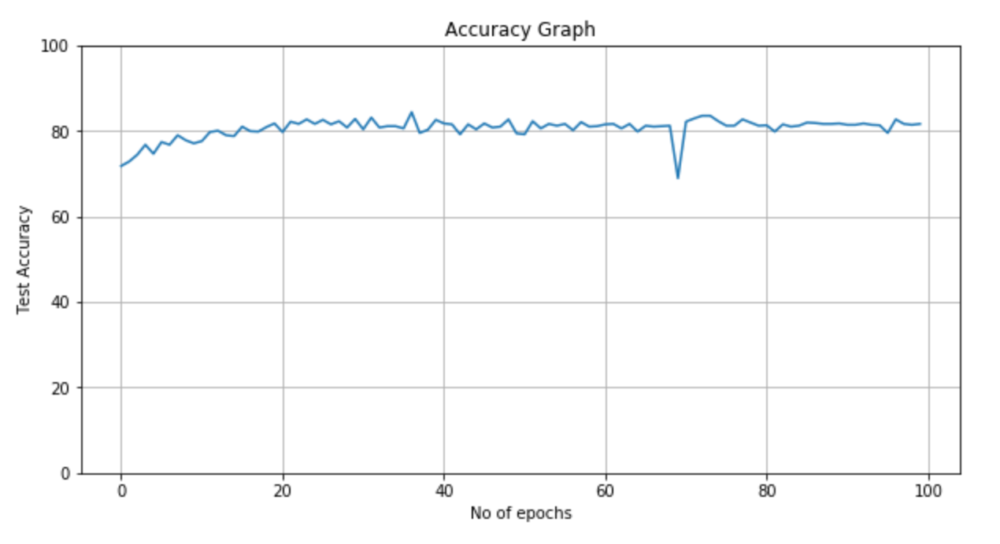
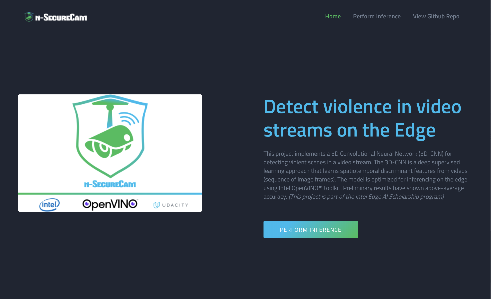
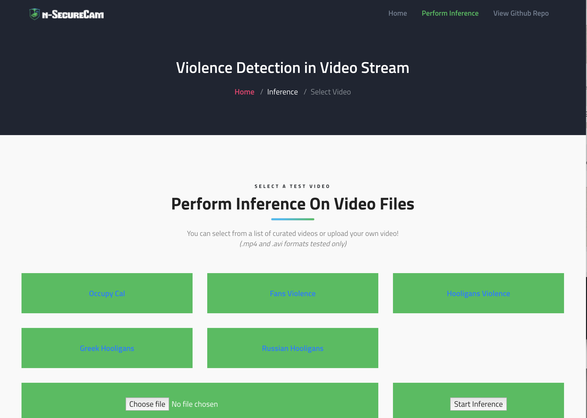

# Violence Detection with C3D

This project implements a 3D Convolutional Neural Network (3D-CNN) for detecting violent scenes in a video stream. The 3D-CNN is a deep supervised learning approach that learns spatiotemporal discriminant features from videos (sequence of image frames). In contrast to 2D convolutions, this approach operates 3D kernels on a series of image frames in their context producing 3D activation maps that captures both spatial and temporal features that could not be properly identified with 2D convolutions.

## System Pipeline

Image source: [1]

Each stage in the project pipeline is displayed in the image below:

* *Pre-Processing:* To avoid overworking the inference engine, the pretrained MobileNet model (from the Intel OpenVINO Model Zoo) is used to detect persons in a given frame. When a person is detected, a stack of 16 frames are collected and passed through the 3D-CNN model to detect violence.

* *Violence Detection:* Each 16 frame sequence is passed throught the trained 3D CNN model which outputs whether the scene is violent or not as probability scores. The class with maximum output is the predicted value.

* *Visualization:* A front-end interface allows the operation of the system to be viewed in real-time. The video frame is played on-screen with an indicator area that flags violent scenes.

* *Alert:* When violence is detected in any of the scenes, nearest security group is notified for immediate response.

## Model Training

The 3D CNN model was custom trained using the architecture shown below:

### Datasets

Three datasets were combined for this task: [Hockey Fight](http://academictorrents.com/details/38d9ed996a5a75a039b84cf8a137be794e7cee89/tech), [Movies](http://academictorrents.com/details/70e0794e2292fc051a13f05ea6f5b6c16f3d3635) and [Crowd Violence](https://www.openu.ac.il/home/hassner/data/violentflows/).

The Hockey Fight dataset contained 1000 video clips with half containing violent scenes and the other non-violent. The Movies dataset contained 200 video clips with half containing violent scenes and the other non-violent. The Crowd violence dataset contained 246 video clips from YouTube with half containing violent scenes and the other non-violent. This gave a total of 1446 videos, with 723 videos each violent and non-violent.

Image frames are extracted from these videos using the script in `/data/video2img.sh` (gotten from [JJBOY](https://github.com/JJBOY/C3D-pytorch)) at a sampling rate of 16 frames per second. This value was chosen arbitrarily and is good enough for a start. The different image frames are then collected into stacks with 16 frames per stack using `/data/create_stacks.py` using information provided in the `/data/train.txt` and `/data/test.txt` that specifies the starting point of each stack. This was necessary as the frames were sent in overlapping sequences.

The entire dataset was divided into training set and test set in the ratio 3:1. This was according to the method in [1]. Both sets were then bundled into the HDF5 format using the `h5py` package.

### Data pre-processing

Each image stack is first resized to 128 by 171 pixels before they are square cropped to 112 by 112 px according to the input shape of the 3D CNN. They are then converted to PyTorch tensors and each of the RGB frames normalized with `mean=[0.485, 0.456, 0.406]` and `std=[0.229, 0.224, 0.225]`. This is a common transformation practice that is derived from the normalization introduced by ImageNet.

### Hyperparameters and Optimization

For the training task, the following hyperparameters were used:

* `num_epochs    = 100`
* `batch_size    = 30`
* `learning_rate = 0.003`

These parameters are in no way optimal, but gave fairly good result for a start.

The stochastic gradient descent optimizer was used for learning with Cross Entropy function was used as the criterion for classification loss.

### Training Setup

The training and test datasets were uploaded to Google Drive since all training was done in Google Colab. Colab is a free cloud service that gives access to free GPU instances and supports most known libraries including PyTorch that was used for this project. The training environment has the following specifications:

* GPU: 1xTesla K80 ,compute 3.7, having 2496 CUDA cores, 12GB GDDR5 VRAM
* CPU: 1xsingle core hyper threaded Xeon Processors @2.3Ghz i.e. (1 core, 2 threads)
* RAM: ~12.6 GB Available
* Disk: ~33 GB Available

## Model Results

### Test Loss

### Test Accuracy

The best accuracy of 84.428% was obtained at the 36th training epoch.

This preliminary model is definitely far from the best. Apparently, the model was subject to overfiiting and a lot of improvement can be achieved with proper training.

## Edge Inferencing

### The Intel OpenVINO™ toolkit

The OpenVINO™ toolkit comes with two special tools that we have used heavily in this project, the _Model Optimizer (MO)_ and _Inference Engine (IE)_. The MO analyses the raw deep learning model from the different frameworks (PyTorch in this case) and adjusts for optimal execution on edge devices. Techniques like freezing, fusion and quantization help to reduce inference execution times while keeping the accuracy at a reasonable threshold. The MO generates a generix XML file describing the optimized model architecture and BIN file containing the weights of each layer in the model. The IE takes these files and ensures accelerated inferencing on Intel based processors (like the AWS Instance this project has been setup). The IE is originally a C++ Library but exposes an API that is used to interface with it in Python as used in this project. For the most part, the boilerplate code provided in the Intel Edge AI Fundamentals course was used to build this project.

### Modifiable Parameters

Currently, the model accepts two parameters as follows:

`-m model_path` = "The path to the model XML file"
`-v video_path` = "The path to the video file"

However, most of these have been hidden behind the web app API so that users do all these without worrying about the complexities. Since only one model has been provided in the cloud instance, that argument is not exposed to the public, but is setup already and simply uses the default value. The video path is sent to the model through the `/getinference/video_path` API call. The server parses this and sends to the model via the `-v video_path` argument. In the future, arguments for the device-specific plugin (CPU, GPU, FPGA etc) or processing type (SYNC, ASYNC) can be added.

## Running the Application

To test the model, you [click on this link to load the Violence Detection Web App](https://keen-lumiere-1599db.netlify.com/). 

Once on the page as shown above, click on 'Run Inference'. This will load the inference page that will provide you with a list of videos with which to choose from. 

Click on any of the links selected and the video results will then be displayed with the red indicator for violent scences and green indicator for peaceful scenes.

## Further Steps

* Train the model to better accuracy by searching for the best hyperparameters and optimizer

The accuracy of identifying violent scences in input video stream can be improved significantly by reworking the training pipeline. Most of the hyperparameters used were by rule-of-thumb, and can be reviewed to search for the best parameters for optimal performance while considering precision as well.

* Implement multi-camera feed system

It is intended that this system is deployed across distributed surveilance camera systems. A central feed system that processes these input streams while still keeping the performance in terms of speed and reliablity is possible. Already, resources by Intel OpenVINO covering this subject have been reviewed and can be implemented in the future.

* Build complete web app for visualization

The web app (for demo) has only been roughly built. A good part of the components have not been connected to fit well. It is intended that the web app is completed for effective monitoring of the performance of this system.

* Implement geolocation for improved violence event reporting

Another important feature that may be considered in the future will be to add geolocation to every surveillance camera installation for informational purposes.

## References

[1] Ullah, F. U. M., Ullah, A., Muhammad, K., Haq, I. U., & Baik, S. W. (2019). Violence Detection Using Spatiotemporal Features with 3D Convolutional Neural Network. *Sensors*, 19(11), 2472. https://doi.org/10.3390/s19112472

[2] Tran, D., Bourdev, L., Fergus, R., Torresani, L., & Paluri, M. (2015). Learning Spatiotemporal Features with 3D Convolutional Networks. *2015 IEEE International Conference on Computer Vision (ICCV)*. https://doi.org/10.1109/iccv.2015.510
